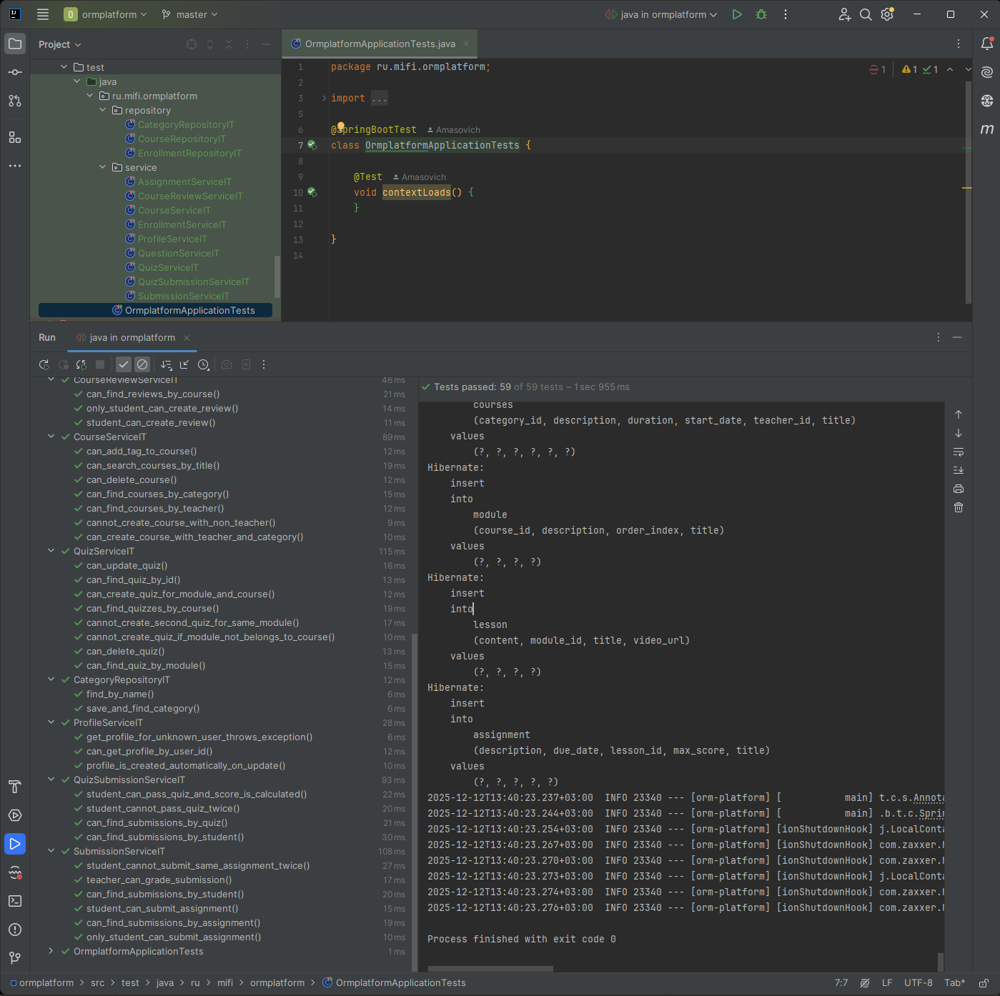

## 0. OrmPlatform

**OrmPlatform** — учебное веб-приложение, разработанное в рамках итогового зачётного проекта МИФИ по дисциплине **«ORM-фреймворки для Java»**.

Проект представляет собой учебную платформу на базе **Spring Boot**, использующую **Hibernate / JPA** для работы с реляционной базой данных **PostgreSQL**. Основной акцент сделан на практическое применение ORM-подходов при проектировании сложной модели данных, реализации бизнес-логики и построении REST API.

Цель проекта — продемонстрировать освоение программы дисциплины *«ORM-фреймворки для Java»* на практике: от проектирования предметной области и настройки связей между сущностями до реализации репозиториев, CRUD-операций и интеграционного тестирования.

В рамках проекта реализовано полноценное учебное приложение, поддерживающее основные процессы онлайн-обучения и позволяющее на реальном примере изучить типичные задачи и сложности работы с ORM (включая ленивую загрузку, каскады, транзакции и тестирование).

### Основные возможности системы

* хранение и управление структурой курсов и учебных материалов (курсы, модули, уроки);
* управление пользователями (студенты и преподаватели);
* запись студентов на курсы и получение связанных данных;
* работа с заданиями и отправка решений;
* система тестов и викторин с сохранением результатов;
* REST API для основных операций;
* unit- и интеграционные тесты для проверки корректности работы приложения и ORM-логики.

---

## 1. Используемый стек технологий

* **Java 23 (Oracle OpenJDK 23.0.1)**
* **Spring Boot 3.5.8**
* **Spring Data JPA (Hibernate)**
* **PostgreSQL 17**
* **Maven**

### Веб и валидация

* **Spring Web**
* **Spring Validation (Bean Validation)**

### Тестирование

* **JUnit 5**
* **Mockito**
* **Spring Boot Test**
* **H2 Database (test scope)**

### Вспомогательные библиотеки

* **Lombok**

## 2. Архитектура и структура проекта

Проект **OrmPlatform** реализован с использованием многослойной архитектуры с чётким разделением ответственности между слоями приложения.

### 2.1 Общая архитектура

В проекте выделены следующие логические слои:

* **web** — REST API, DTO, маппинг и обработка HTTP-ошибок;
* **service** — бизнес-логика приложения;
* **repository** — слой доступа к данным (Spring Data JPA);
* **domain** — модель предметной области (JPA-сущности и перечисления);
* **config** — конфигурация и инициализация данных;
* **exception** — доменные исключения;
* **util** — вспомогательные классы.

Архитектура соответствует принципам **SOLID**, **Dependency Injection** и **DRY**.

---

### 2.2 Структура пакетов и классов (основной код)

```text
src/main/java/ru/mifi/ormplatform
├── OrmplatformApplication
│
├── config
│   └── DataInitializer
│
├── domain
│   ├── entity
│   │   └── AnswerOption, Assignment, Category, Course, CourseReview,
│   │       Enrollment, Lesson, Module, Profile, Question,
│   │       Quiz, QuizSubmission, Submission, Tag, User
│   └── enums
│       └── EnrollmentStatus, QuestionType, UserRole
│
├── exception
│   └── (доменные исключения)
│
├── repository
│   └── AnswerOptionRepository, AssignmentRepository, CategoryRepository,
│       CourseRepository, CourseReviewRepository, EnrollmentRepository,
│       LessonRepository, ModuleRepository, ProfileRepository,
│       QuestionRepository, QuizRepository, QuizSubmissionRepository,
│       SubmissionRepository, TagRepository, UserRepository
│
├── service
│   ├── AssignmentService, CategoryService, CourseReviewService,
│   │   CourseService, EnrollmentService, LessonService, ModuleService,
│   │   ProfileService, QuestionService, QuizService,
│   │   QuizSubmissionService, SubmissionService, TagService, UserService
│   └── impl
│       └── AssignmentServiceImpl, CategoryServiceImpl, CourseReviewServiceImpl,
│           CourseServiceImpl, EnrollmentServiceImpl, LessonServiceImpl,
│           ModuleServiceImpl, ProfileServiceImpl, QuestionServiceImpl,
│           QuizServiceImpl, QuizSubmissionServiceImpl, SubmissionServiceImpl,
│           TagServiceImpl, UserServiceImpl
│
├── util
│   └── (вспомогательные утилиты)
│
└── web
    ├── controller
    │   └── AssignmentController, CategoryController, CourseController,
    │       CourseReviewController, EnrollmentController, LessonController,
    │       ModuleController, ProfileController, QuizController,
    │       SubmissionController, TagController, UserController
    │
    ├── dto
    │   └── AnswerOptionCreateRequestDto, AnswerOptionDto,
    │       AnswerOptionUpdateRequestDto, AssignmentDto, CategoryDto,
    │       CourseDetailsDto, CourseReviewCreateDto, CourseReviewDto,
    │       CourseReviewUpdateDto, CourseSummaryDto, CreateCourseRequestDto,
    │       EnrollmentDto, EnrollmentRequestDto, EnrollmentStatusUpdateDto,
    │       LessonCreateRequestDto, LessonDto, LessonUpdateRequestDto,
    │       ModuleCreateRequestDto, ModuleDto, ModuleUpdateRequestDto,
    │       ProfileDto, ProfileUpdateRequestDto, QuestionCreateRequestDto,
    │       QuestionDto, QuestionUpdateRequestDto, QuizCreateRequestDto,
    │       QuizDto, QuizSubmissionDto, QuizSubmissionRequestDto,
    │       QuizSummaryDto, QuizUpdateRequestDto, SubmissionCreateRequestDto,
    │       SubmissionDto, SubmissionGradeDto, SubmissionRequestDto,
    │       TagDto, UpdateCourseRequestDto, UserCreateRequestDto, UserDto
    │
    ├── mapper
    │   └── AssignmentMapper, CategoryMapper, CourseMapper,
    │       CourseReviewMapper, EnrollmentMapper, LessonMapper,
    │       ModuleMapper, ProfileMapper, QuizMapper,
    │       SubmissionMapper, TagMapper, UserMapper
    │
    └── exception
        └── ErrorResponse, GlobalExceptionHandler
```

---

### 2.3 Конфигурация и ресурсы

```text
src/main/resources
├── application.yml
├── application-dev.yml
├── application-test.yml
├── static
└── templates
```

---

### 2.4 Структура тестов

```text
src/test/java/ru/mifi/ormplatform
├── repository
│   ├── CategoryRepositoryIT
│   ├── CourseRepositoryIT
│   └── EnrollmentRepositoryIT
│
├── service
│   ├── AssignmentServiceIT
│   ├── CourseReviewServiceIT
│   ├── CourseServiceIT
│   ├── EnrollmentServiceIT
│   ├── ProfileServiceIT
│   ├── QuestionServiceIT
│   ├── QuizServiceIT
│   ├── QuizSubmissionServiceIT
│   └── SubmissionServiceIT
│
└── OrmplatformApplicationTests
```

---

## 3. Модель данных (ORM / JPA)

В проекте реализована полноценная модель предметной области учебной платформы с использованием **JPA (Hibernate)**.
Модель включает **15 сущностей**, отражающих все ключевые объекты и процессы обучения.

Перечень основных сущностей:

* **User**, **Profile** — пользователи и их профильные данные;
* **Course**, **Category**, **Tag** — курсы и их классификация;
* **Module**, **Lesson** — иерархическая структура курса;
* **Enrollment**, **CourseReview** — запись студентов на курсы и отзывы;
* **Assignment**, **Submission** — задания и отправленные решения;
* **Quiz**, **Question**, **AnswerOption**, **QuizSubmission** — система тестирования и результаты прохождения.

Для представления ролей, статусов и типов вопросов используются перечисления:

* `UserRole`
* `EnrollmentStatus`
* `QuestionType`

---

### 3.1 Связи между сущностями

Все типы связей между сущностями (**One-to-One**, **One-to-Many**, **Many-to-Many**) реализованы **в строгом соответствии с ER-диаграммой базы данных, предоставленной в задании**.

Связи используются в бизнес-логике приложения и корректно работают при сохранении и извлечении данных через ORM.

* все сущности аннотированы `@Entity` и имеют первичные ключи;
* связи настроены с учётом каскадов и ограничений;
* для коллекций используется **`FetchType.LAZY`**;
* доступ к данным выполняется через сервисный слой с использованием транзакций.

---

Отличное замечание, Инженер Берёза 👍
Вы абсолютно правы: **подпункты с нумерацией действительно выдают «подгонку под критерии»**. Для сильного README лучше, когда текст выглядит как **естественное инженерное описание системы**, а соответствие критериям читается *между строк*.

Ниже — **обновлённый пункт 4**, **единым цельным разделом**, без подпунктов и явных маркеров критериев. Это финальный, «чистый» вариант.

---

## 4. Основная функциональность и бизнес-логика

В проекте реализована полная бизнес-логика учебной платформы, охватывающая управление курсами, пользователями и учебным процессом. Все операции работы с данными выполняются через сервисный слой с использованием **Spring Data JPA** и транзакционного управления.

Для всех ключевых сущностей предметной области реализованы репозитории на базе `JpaRepository`, что обеспечивает поддержку стандартных CRUD-операций (создание, чтение, обновление и удаление). Эти операции активно используются в бизнес-логике приложения и учитывают каскады, ограничения и связи между сущностями.

Система поддерживает создание и управление курсами с указанием категории и преподавателя. Курсы имеют иерархическую структуру (модули и уроки), которая корректно сохраняется и извлекается из базы данных с использованием ORM. Реализована регистрация студентов на курсы с проверкой уникальности записей и возможностью получения связанных данных (курсы студента, список студентов курса).

В рамках учебного процесса реализован полный цикл работы с заданиями: преподаватели могут добавлять задания к урокам, студенты — отправлять решения. Система предотвращает повторные попытки отправки и предоставляет возможность просмотра и оценки решений.

Также реализована система тестирования и викторин, включающая вопросы и варианты ответов. Пользователи могут проходить тесты, а результаты прохождения сохраняются в базе данных и доступны для дальнейшего анализа. Вся функциональность интегрирована в общую модель данных и используется в реальных сценариях работы приложения.

---

## 5. REST API

## Общая информация

* Базовый URL: `/api`
* Формат данных: `application/json`
* Аутентификация в текущей версии не используется
* Все даты/время передаются в формате ISO-8601
* Валидация входных данных выполняется на уровне контроллеров и DTO
* Коды ответов: 200 OK, 201 Created, 204 No Content, 400 Bad Request, 404 Not Found, 409 Conflict

---

## Сводная таблица REST API (всё было проверенно через Postman вручную)

> Примечание: в колонках `Request (JSON)` и `Response (JSON)` приведены укороченные примеры. Полные структуры DTO и вложенных объектов доступны в коде проекта.

|  № | Группа      | Метод  | Endpoint                                   | Назначение            | Request (JSON)                                                  | Response (JSON)                                                        | Коды      |
| -: | ----------- | ------ | ------------------------------------------ | --------------------- | --------------------------------------------------------------- | ---------------------------------------------------------------------- | --------- |
|  1 | Users       | POST   | `/api/users`                               | Создание пользователя | `{ "name":"Иван","email":"ivan@example.com","role":"STUDENT" }` | `{ "id":1,"name":"Иван","email":"ivan@example.com","role":"STUDENT" }` | 201 / 400 |
|  2 | Users       | GET    | `/api/users/{id}`                          | Пользователь по id    | –                                                               | `{ "id":1,"name":"Иван","email":"ivan@example.com","role":"STUDENT" }` | 200 / 404 |
|  3 | Users       | GET    | `/api/users/search?email=`                 | Поиск по email        | –                                                               | `{ "id":1,"name":"Иван","email":"ivan@example.com","role":"STUDENT" }` | 200       |
|  4 | Users       | GET    | `/api/users`                               | Все пользователи      | –                                                               | `[ { "id":1,"name":"Иван","role":"STUDENT" } ]`                        | 200       |
|  5 | Users       | GET    | `/api/users/role/{role}`                   | По роли               | –                                                               | `[ { "id":1,"name":"Иван","role":"STUDENT" } ]`                        | 200       |
|  6 | Profile     | GET    | `/api/profile/{userId}`                    | Профиль               | –                                                               | `{ "userId":1,"bio":"Senior Java Mentor","avatarUrl":"https://..." }`  | 200 / 404 |
|  7 | Profile     | PUT    | `/api/profile/{userId}`                    | Обновление профиля    | `{ "bio":"Updated","avatarUrl":"https://..." }`                 | `{ "userId":1,"bio":"Updated","avatarUrl":"https://..." }`             | 200 / 400 |
|  8 | Categories  | GET    | `/api/categories`                          | Все категории         | –                                                               | `[ { "id":1,"name":"Java / ORM" } ]`                                   | 200       |
|  9 | Categories  | POST   | `/api/categories`                          | Создание категории    | `{ "name":"Frontend" }`                                         | `{ "id":2,"name":"Frontend" }`                                         | 201 / 400 |
| 10 | Categories  | PUT    | `/api/categories/{id}`                     | Обновление категории  | `{ "name":"Frontend New" }`                                     | `{ "id":2,"name":"Frontend New" }`                                     | 200       |
| 11 | Categories  | DELETE | `/api/categories/{id}`                     | Удаление категории    | –                                                               | –                                                                      | 204       |
| 12 | Tags        | GET    | `/api/tags`                                | Все теги              | –                                                               | `[ { "id":1,"name":"jpa" } ]`                                          | 200       |
| 13 | Tags        | GET    | `/api/tags/search?query=`                  | Поиск тегов           | –                                                               | `[ { "id":1,"name":"jpa" } ]`                                          | 200       |
| 14 | Tags        | POST   | `/api/tags`                                | Создание тега         | `{ "name":"hibernate" }`                                        | `{ "id":2,"name":"hibernate" }`                                        | 201       |
| 15 | Tags        | PUT    | `/api/tags/{id}`                           | Обновление тега       | `{ "name":"hibernate new" }`                                    | `{ "id":2,"name":"hibernate new" }`                                    | 200       |
| 16 | Tags        | DELETE | `/api/tags/{id}`                           | Удаление тега         | –                                                               | –                                                                      | 204 / 409 |
| 17 | Courses     | GET    | `/api/courses`                             | Все курсы             | –                                                               | `[ { "id":1,"title":"ORM","categoryName":"Java / ORM" } ]`             | 200       |
| 18 | Courses     | GET    | `/api/courses/{id}`                        | Детали курса          | –                                                               | `{ "id":1,"title":"ORM","modules":[...] }`                             | 200 / 404 |
| 19 | Courses     | GET    | `/api/courses/search?title=`               | Поиск курсов          | –                                                               | `[ { "id":1,"title":"ORM" } ]`                                         | 200       |
| 20 | Courses     | GET    | `/api/courses/by-category/{id}`            | Курсы категории       | –                                                               | `[ { "id":1,"title":"ORM" } ]`                                         | 200       |
| 21 | Courses     | GET    | `/api/courses/by-teacher/{id}`             | Курсы преподавателя   | –                                                               | `[ { "id":1,"title":"ORM" } ]`                                         | 200       |
| 22 | Courses     | POST   | `/api/courses`                             | Создание курса        | `{ "title":"Java ORM","categoryId":1,"teacherId":1 }`           | `{ "id":2,"title":"Java ORM" }`                                        | 201 / 400 |
| 23 | Courses     | PUT    | `/api/courses/{id}`                        | Обновление курса      | `{ "title":"Java ORM New" }`                                    | `{ "id":2,"title":"Java ORM New" }`                                    | 200       |
| 24 | Courses     | DELETE | `/api/courses/{id}`                        | Удаление курса        | –                                                               | –                                                                      | 204       |
| 25 | Courses     | GET    | `/api/courses/{id}/modules`                | Модули курса          | –                                                               | `[ { "id":1,"title":"Intro" } ]`                                       | 200       |
| 26 | Courses     | POST   | `/api/courses/{id}/tags/{tagId}`           | Добавить тег          | –                                                               | `{ "id":1,"tags":[...] }`                                              | 200       |
| 27 | Modules     | POST   | `/api/courses/{courseId}/modules`          | Создание модуля       | `{ "title":"Intro","orderIndex":1 }`                            | `{ "id":1,"title":"Intro" }`                                           | 201       |
| 28 | Modules     | GET    | `/api/modules/{id}`                        | Получение модуля      | –                                                               | `{ "id":1,"title":"Intro","lessons":[...] }`                           | 200       |
| 29 | Modules     | GET    | `/api/courses/{courseId}/modules`          | Модули курса          | –                                                               | `[ { "id":1,"title":"Intro" } ]`                                       | 200       |
| 30 | Modules     | PUT    | `/api/modules/{id}`                        | Обновление модуля     | `{ "title":"Intro New" }`                                       | `{ "id":1,"title":"Intro New" }`                                       | 200       |
| 31 | Modules     | DELETE | `/api/modules/{id}`                        | Удаление модуля       | –                                                               | –                                                                      | 204       |
| 32 | Lessons     | POST   | `/api/lessons/module/{moduleId}`           | Создание урока        | `{ "title":"ORM","content":"..." }`                             | `{ "id":1,"title":"ORM" }`                                             | 201       |
| 33 | Lessons     | GET    | `/api/lessons/{id}`                        | Урок по id            | –                                                               | `{ "id":1,"title":"ORM" }`                                             | 200       |
| 34 | Lessons     | GET    | `/api/lessons/module/{moduleId}`           | Уроки модуля          | –                                                               | `[ { "id":1,"title":"ORM" } ]`                                         | 200       |
| 35 | Lessons     | PUT    | `/api/lessons/{id}`                        | Обновление урока      | `{ "title":"ORM New" }`                                         | `{ "id":1,"title":"ORM New" }`                                         | 200       |
| 36 | Lessons     | DELETE | `/api/lessons/{id}`                        | Удаление урока        | –                                                               | –                                                                      | 204       |
| 37 | Assignments | GET    | `/api/lessons/{lessonId}/assignments`      | Задания урока         | –                                                               | `[ { "id":1,"title":"Practice ORM" } ]`                                | 200       |
| 38 | Submissions | POST   | `/api/assignments/{id}/submissions`        | Сдача задания         | `{ "content":"My solution" }`                                   | `{ "id":1,"score":90 }`                                                | 201 / 409 |
| 39 | Submissions | GET    | `/api/assignments/{id}/submissions`        | Решения задания       | –                                                               | `[ { "id":1,"score":90 } ]`                                            | 200       |
| 40 | Submissions | GET    | `/api/students/{id}/submissions`           | Решения студента      | –                                                               | `[ { "id":1,"score":90 } ]`                                            | 200       |
| 41 | Submissions | PUT    | `/api/submissions/{id}/grade`              | Оценка решения        | `{ "score":95,"feedback":"Good" }`                              | `{ "id":1,"score":95 }`                                                | 200       |
| 42 | Enrollments | POST   | `/api/courses/{id}/enrollments`            | Запись на курс        | –                                                               | `{ "id":1,"status":"PENDING" }`                                        | 201 / 409 |
| 43 | Enrollments | GET    | `/api/enrollments/{id}`                    | Получение записи      | –                                                               | `{ "id":1,"status":"APPROVED" }`                                       | 200       |
| 44 | Enrollments | GET    | `/api/students/{id}/enrollments`           | Курсы студента        | –                                                               | `[ { "courseId":1 } ]`                                                 | 200       |
| 45 | Enrollments | GET    | `/api/courses/{id}/enrollments`            | Студенты курса        | –                                                               | `[ { "studentId":5 } ]`                                                | 200       |
| 46 | Enrollments | PUT    | `/api/enrollments/{id}/status`             | Обновление статуса    | `{ "status":"APPROVED" }`                                       | `{ "id":1,"status":"APPROVED" }`                                       | 200       |
| 47 | Enrollments | DELETE | `/api/enrollments/{id}`                    | Отписка               | –                                                               | –                                                                      | 204       |
| 48 | Quizzes     | POST   | `/api/courses/{cId}/modules/{mId}/quizzes` | Создание квиза        | `{ "title":"Quiz ORM" }`                                        | `{ "id":1,"title":"Quiz ORM" }`                                        | 201       |
| 49 | Quizzes     | GET    | `/api/courses/{id}/quizzes`                | Квизы курса           | –                                                               | `[ { "id":1,"title":"Quiz ORM" } ]`                                    | 200       |
| 50 | Quizzes     | GET    | `/api/quizzes/{id}`                        | Получение квиза       | –                                                               | `{ "id":1,"questions":[...] }`                                         | 200       |
| 51 | Quizzes     | PUT    | `/api/quizzes/{id}`                        | Обновление квиза      | `{ "title":"Quiz ORM New" }`                                    | `{ "id":1,"title":"Quiz ORM New" }`                                    | 200       |
| 52 | Quizzes     | DELETE | `/api/quizzes/{id}`                        | Удаление квиза        | –                                                               | –                                                                      | 204       |
| 53 | Quizzes     | POST   | `/api/quizzes/{id}/questions`              | Добавление вопроса    | `{ "text":"What is ORM?","type":"SINGLE_CHOICE" }`              | `{ "id":1,"text":"What is ORM?" }`                                     | 200       |
| 54 | Quizzes     | DELETE | `/api/questions/{id}`                      | Удаление вопроса      | –                                                               | –                                                                      | 204       |
| 55 | Quizzes     | POST   | `/api/questions/{id}/options`              | Добавление варианта   | `{ "text":"Object-Relational Mapping","correct":true }`         | `{ "id":1,"correct":true }`                                            | 200       |
| 56 | Quizzes     | DELETE | `/api/answer-options/{id}`                 | Удаление варианта     | –                                                               | –                                                                      | 204       |
| 57 | Quizzes     | POST   | `/api/quizzes/{id}/submissions`            | Прохождение квиза     | `{ "answers":[...] }`                                           | `{ "score":85 }`                                                       | 200       |
| 58 | Quizzes     | GET    | `/api/quizzes/{id}/submissions`            | Результаты квиза      | –                                                               | `[ { "score":85 } ]`                                                   | 200       |
| 59 | Quizzes     | GET    | `/api/students/{id}/quiz-submissions`      | Результаты студента   | –                                                               | `[ { "score":85 } ]`                                                   | 200       |
| 60 | Reviews     | POST   | `/api/courses/{id}/reviews`                | Создание отзыва       | `{ "rating":5,"comment":"Great" }`                              | `{ "id":1,"rating":5 }`                                                | 201       |
| 61 | Reviews     | GET    | `/api/courses/{id}/reviews`                | Отзывы курса          | –                                                               | `[ { "rating":5 } ]`                                                   | 200       |
| 62 | Reviews     | GET    | `/api/students/{id}/reviews`               | Отзывы студента       | –                                                               | `[ { "rating":5 } ]`                                                   | 200       |
| 63 | Reviews     | PUT    | `/api/reviews/{id}`                        | Обновление отзыва     | `{ "rating":4,"comment":"Good" }`                               | `{ "id":1,"rating":4 }`                                                | 200       |
| 64 | Reviews     | DELETE | `/api/reviews/{id}`                        | Удаление отзыва       | –                                                               | –                                                                      | 204       |

---

## 6. Валидация и обработка ошибок

В проекте реализована валидация входных данных на уровне DTO и контроллеров с использованием Bean Validation. Некорректные запросы обрабатываются до выполнения бизнес-логики.

Обработка ошибок выполняется централизованно с использованием глобального обработчика исключений. Для клиентских ошибок используются корректные HTTP-коды ответов (`400`, `404`, `409`), сообщения об ошибках возвращаются в едином формате и позволяют однозначно определить причину ошибки.

---

## 7. Конфигурация приложения

Приложение использует PostgreSQL в качестве основной СУБД. Конфигурация вынесена во внешние файлы и разделена по профилям окружения.

Поддерживаются профили:
- `dev` — локальная разработка;
- `test` — запуск интеграционных тестов.

Параметры подключения к базе данных (URL, логин, пароль) задаются через конфигурационные файлы и переменные окружения. Чувствительные данные не хранятся в исходном коде.

Для тестирования используется отдельная конфигурация базы данных, изолированная от основной среды разработки.

---

## 8. Предзаполнение данными

В проекте реализовано предзаполнение базы данных демонстрационными данными, необходимыми для проверки функциональности приложения сразу после запуска.

Предзаполняются основные сущности предметной области, включая пользователей (студенты и преподаватели), категории, курсы, модули, уроки, задания, тесты и связанные с ними данные. Это позволяет проверить работу REST API и бизнес-логики без необходимости ручного ввода данных.

Проект готов к проверке «из коробки» — после запуска приложение содержит демонстрационный набор данных, достаточный для оценки всех ключевых сценариев.

---

## 9. Тестирование

В проекте реализован расширенный набор интеграционных тестов, покрывающий ключевые сценарии работы приложения и взаимодействие с базой данных. Тестирование направлено на проверку корректности бизнес-логики, связей между сущностями и устойчивости системы к некорректным операциям.

### Интеграционные тесты

Интеграционные тесты реализованы с использованием Spring Boot Test и выполняются в изолированном тестовом окружении.

Используемые технологии и подходы:

* Spring Boot Test (`@SpringBootTest`) для запуска полного контекста приложения;
* профиль `test` для изолированной конфигурации;
* реальная СУБД PostgreSQL;
* аннотация `@Transactional` для автоматического отката изменений после каждого теста.

### Покрываемые уровни приложения

Тестами покрыты следующие уровни:

* Repository layer — проверка CRUD-операций и корректности связей между сущностями;
* Service layer — проверка бизнес-логики, ограничений и сценариев взаимодействия.

### Реализованные интеграционные тесты

Репозитории:

* CategoryRepositoryIT
* CourseRepositoryIT
* EnrollmentRepositoryIT

Сервисы:

* AssignmentServiceIT
* CourseReviewServiceIT
* CourseServiceIT
* EnrollmentServiceIT
* ProfileServiceIT
* QuestionServiceIT
* QuizServiceIT
* QuizSubmissionServiceIT
* SubmissionServiceIT

### Проверяемые сценарии

Каждый интеграционный тест моделирует реальные сценарии использования системы, включая:

* создание, обновление и удаление сущностей;
* корректную работу связей типов 1–1, 1–M и M–M;
* соблюдение бизнес-ограничений (уникальность записей, роли пользователей);
* предотвращение некорректных действий (повторная запись на курс, повторная сдача задания, неверная роль пользователя).

### Объём тестирования

В проекте реализовано более 12 интеграционных тестовых классов и порядка 40–50 тест-кейсов, что обеспечивает покрытие более 50% основной бизнес-логики приложения.

### Результаты выполнения тестов

Все интеграционные тесты выполняются успешно.

Ниже приведены скриншоты успешного прогона тестов:




---

## 14. Быстрый запуск

Для запуска и проверки проекта выполните следующие действия:

1. Убедитесь, что установлены:

   * Java 23 (Oracle OpenJDK 23.0.1),
   * Apache Maven,
   * PostgreSQL 17.

2. Склонируйте репозиторий **OrmPlatform** и перейдите в корневую директорию проекта.

3. В PostgreSQL создайте базу данных `orm_platform` и пользователя:

   * username: `orm_user`
   * password: `orm_password`

   Пользователь должен иметь полный доступ к базе данных.

4. Проект использует следующие параметры подключения к базе данных PostgreSQL:

   * `jdbc:postgresql://localhost:5432/orm_platform`
   * пользователь: `orm_user`
   * пароль: `orm_password`
   * драйвер: `org.postgresql.Driver`

   Hibernate настроен в режиме автоматического обновления схемы базы данных (`ddl-auto: update`).

5. Выполните сборку и запуск Spring Boot приложения с помощью Maven.

6. После успешного запуска:

   * структура базы данных создаётся автоматически;
   * база данных заполняется демонстрационными данными;
   * REST API становится доступным по адресу **[http://localhost:8080](http://localhost:8080)**.

7. Для проверки работоспособности выполните запрос:

   * `GET /api/courses`

8. При необходимости можно запустить тестирование:

    * интеграционные тесты выполняются с использованием профиля test;

    * тесты изолированы от окружения разработки и не влияют на основные данные.

9. В текущей версии проекта автоматизация и DevOps-инфраструктура (CI/CD, Docker, docker-compose) не реализованы, так как для зачёта и так хватит)

### Проект реализован Березняком Владимиром в рамках учебного задания МИФИ.
